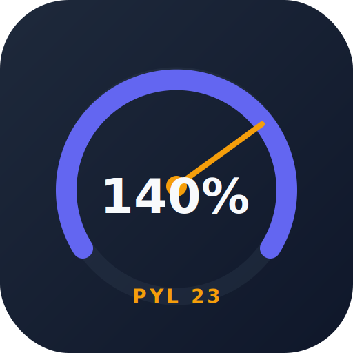

# Calculadora Kavana - Industrial Production Calculator



A Progressive Web Application for industrial production efficiency calculation, designed for factory floor operators with offline-first capabilities.

---

## 1. Executive Summary

**Calculadora Kavana** is a client-side web application that provides production efficiency calculation capabilities without requiring backend infrastructure. The solution is designed for manufacturing environments where internet connectivity may be limited.

### Key Features

- **Zero Infrastructure**: No servers, databases, or API keys required
- **Offline-First**: 100% functional without internet connection
- **PWA Ready**: Installable on devices, works like native app
- **Data Portability**: Import/export capabilities for backup and migration

---

## 2. System Architecture

### 2.1 Technology Stack

| Layer | Technology | Version | Purpose |
|-------|------------|---------|---------|
| **Runtime** | ES Modules (Native) | ES2022 | Module system |
| **Storage** | localStorage | Browser API | Data persistence |
| **Export** | SheetJS (xlsx) | 0.20.2 | Excel export |
| **PWA** | Service Worker | Standard | Offline support |
| **Testing** | Node.js test runner | Built-in | Unit testing |

### 2.2 Architecture Diagram

```
┌─────────────────────────────────────────────────────────────────────────────┐
│                   KAVANA CALCULATOR ARCHITECTURE                             │
├─────────────────────────────────────────────────────────────────────────────┤
│  ┌─────────────┐  ┌─────────────┐  ┌─────────────┐                         │
│  │   Storage   │  │   Storage   │  │   Storage   │                         │
│  │  (Session)  │  │ (Templates) │  │  (History)  │                         │
│  └─────────────┘  └─────────────┘  └─────────────┘                         │
├─────────────────────────────────────────────────────────────────────────────┤
│                    Application Layer                                         │
│  ┌─────────────┐  ┌─────────────┐  ┌─────────────┐                         │
│  │ Production  │  │ Templates   │  │  History    │                         │
│  │    UI       │  │    UI       │  │    UI       │                         │
│  └─────────────┘  └─────────────┘  └─────────────┘                         │
├─────────────────────────────────────────────────────────────────────────────┤
│                    Business Logic Layer                                      │
│  ┌─────────────┐  ┌─────────────┐  ┌─────────────┐                         │
│  │ Calculator  │  │   Storage   │  │  Exporter   │                         │
│  │    Engine   │  │   Helper    │  │   Module    │                         │
│  └─────────────┘  └─────────────┘  └─────────────┘                         │
└─────────────────────────────────────────────────────────────────────────────┘
```

---

## 3. Functional Modules

### 3.1 Core Functionality

| Module | Description |
|--------|-------------|
| **Template Management** | Create and configure production templates with models and measurements |
| **Efficiency Calculation** | Real-time calculation of production efficiency |
| **Session History** | Track and export historical production data |
| **Excel Export** | Generate .xlsx files for integration with office systems |

### 3.2 Technical Features

| Feature | Implementation |
|---------|----------------|
| **Offline-First** | 100% functional without internet connection |
| **PWA Ready** | Installable on devices, works like native app |
| **Zero Infrastructure** | No servers, databases, or API keys required |
| **Data Portability** | Import/export capabilities for backup and migration |

---

## 4. Project Structure

```
calculadora-kavana/
├── css/
│   └── styles.css          # CSS Variables theme system
├── js/
│   ├── app.js              # Application orchestrator
│   ├── calculator.js       # Business logic (TDD-ready)
│   ├── export.js           # Excel/JSON export module
│   ├── store.js            # localStorage abstraction
│   ├── theme.js            # Theme management
│   ├── ui-history.js       # History tab controller
│   ├── ui-production.js    # Production tab controller
│   └── ui-templates.js     # Templates tab controller
├── docs/
│   ├── roadmap.md          # Technical architecture roadmap
│   └── DECISIONES_ESTRATEGICAS.md
├── screenshots/            # LinkedIn showcase screenshots
├── index.html              # SPA root
├── manifest.json           # PWA configuration
├── sw.js                   # Service Worker
└── icon.svg                # Application icon
```

---

## 5. Development

### 5.1 Prerequisites

- Node.js (for running tests)
- Modern browser with ES Modules support

### 5.2 Local Development

```bash
# Run unit tests
node --test tests/engine.test.js

# Start development server
npx serve .
```

### 5.3 Testing

```bash
# Run all tests
node --test tests/engine.test.js

# Expected output
# tests 19
# suites 4
# pass 19
# fail 0
```

---

## 6. Data Model

### 6.1 Template

```typescript
interface Template {
  id: string;
  name: string;
  enableEfficiency: boolean;
  efficiencyType: 'pieces_per_hour' | 'meters_per_hour' | null;
  expectedEfficiency: number | null;
  models: Model[];
}

interface Model {
  id: string;
  name: string;
  piecesPerPallet: number;
  measures: Measure[];
}
```

### 6.2 Production Session

```typescript
interface ProductionSession {
  id: string;
  templateId: string;
  date: string;
  shiftHours: number;
  entries: ProductionEntry[];
  efficiency: number | null;
  totalPieces: number;
  totalMeters: number;
}
```

---

## 7. Security

| Control | Implementation |
|---------|----------------|
| Input Validation | Client-side validation |
| XSS Prevention | `escapeHtml()` utility |
| Data Isolation | localStorage per-origin |
| No Secrets | Client-side only |

---

## 8. Deployment

### 8.1 GitHub Pages

```bash
# Simply push to gh-pages branch or configure in settings
# No build step required
```

### 8.2 Vercel / Static Hosting

```bash
# Drag and drop project folder to Vercel
# Or use: vercel deploy
```

---

## 9. License

MIT License - See LICENSE file for details.

---

## 10. Portfolio Notes

This project demonstrates:

- **Vanilla JS Architecture**: No frameworks, pure ES Modules
- **PWA Implementation**: Service Worker, manifest, offline capability
- **TDD Workflow**: Tests written before implementation
- **Data Architecture**: localStorage abstraction layer
- **UI/UX Design**: Responsive, accessible, mobile-first

---

*Built by System Architecture Team. Part of the Kavana Production Tools portfolio.*
