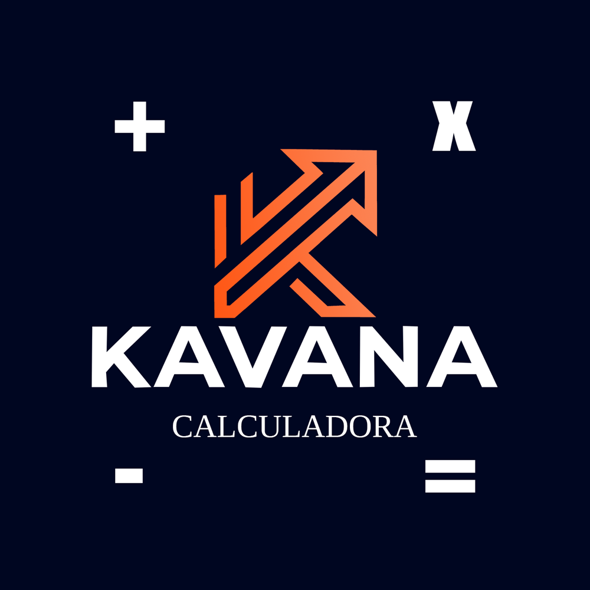

# Calculadora Kavana

### Herramienta de Cálculo de Eficiencia para Producción Industrial

<p align="center">
  
</p>

<p align="center">
  <strong>Progressive Web Application</strong> · Offline-First · Zero Infrastructure<br>
  <em>Diseñada para el suelo de fábrica donde la conectividad no está garantizada</em>
</p>

---

## Resumen Ejecutivo

**Calculadora Kavana** es una aplicación web progresiva (PWA) diseñada para el cálculo de eficiencia en líneas de producción industrial. Desarrollada bajo una arquitectura **client-side pura** (sin backend), garantiza funcionamiento 100% offline en dispositivos móviles, tablets industriales y terminales de planta.

### Propuesta de Valor

| Métrica | Impacto |
|---------|---------|
| **Coste de Infraestructura** | $0 — Sin servidores, bases de datos ni API keys |
| **Disponibilidad** | 100% offline — Funciona sin conexión a internet |
| **Despliegue** | Estático — Compatible con GitHub Pages, Vercel, Nginx, cualquier CDN |
| **Portabilidad** | Export/Import JSON — Migración de datos entre dispositivos |
| **Tiempo de Carga** | <500ms — Sin framework, sin bundler, sin dependencias pesadas |

### Características Principales

- **Gestión de Plantillas**: Configuración de líneas de producción con modelos, medidas y parámetros de eficiencia
- **Cálculo de Eficiencia**: Cálculo en tiempo real de la eficiencia del turno en piezas/hora o metros/hora
- **Meta 100%**: Visualización del目标 de producción necesario para alcanzar el 100% de eficiencia
- **Temas Visuales**: 6 paletas de colores para identificación rápida de líneas
- **Exportación Excel**: Generación de archivos .xlsx conSheetJS para integración con sistemas ofimáticos
- **Backup JSON**: Respaldo e importación completa de datos
- **PWA Instalable**: Se puede instalar en dispositivos como aplicación nativa

---

## Arquitectura del Sistema

### Diagrama de Componentes

```
┌─────────────────────────────────────────────────────────────────────┐
│                    CALCULADORA KAVANA - ARQUITECTURA                │
├─────────────────────────────────────────────────────────────────────┤
│                                                                     │
│  ┌───────────────────────────────────────────────────────────────┐  │
│  │                    PRESENTATION LAYER                         │  │
│  │  ┌──────────────┐  ┌──────────────┐  ┌──────────────┐        │  │
│  │  │   Production │  │  Templates   │  │   History    │        │  │
│  │  │      UI      │  │      UI      │  │      UI      │        │  │
│  │  │ (ui-prod.js) │  │ (ui-tpl.js)  │  │ (ui-hist.js) │        │  │
│  │  └──────────────┘  └──────────────┘  └──────────────┘        │  │
│  └───────────────────────────────────────────────────────────────┘  │
│                              │                                      │
│                    CustomEvent Bus                                   │
│                              │                                      │
│  ┌───────────────────────────────────────────────────────────────┐  │
│  │                   BUSINESS LOGIC LAYER                        │  │
│  │  ┌──────────────┐  ┌──────────────┐  ┌──────────────┐        │  │
│  │  │  Calculator  │  │    Store     │  │   Exporter   │        │  │
│  │  │    Engine    │  │   Helper     │  │    Module    │        │  │
│  │  │(calculator.js)│ │  (store.js)  │  │  (export.js) │        │  │
│  │  └──────────────┘  └──────────────┘  └──────────────┘        │  │
│  └───────────────────────────────────────────────────────────────┘  │
│                              │                                      │
│  ┌───────────────────────────────────────────────────────────────┐  │
│  │                    PERSISTENCE LAYER                          │  │
│  │  ┌──────────────────────────────────────────────────────┐     │  │
│  │  │              localStorage (Browser API)               │     │  │
│  │  │    Templates: prodcalc_templates                      │     │  │
│  │  │    Sessions:  prodcalc_sessions                       │     │  │
│  │  └──────────────────────────────────────────────────────┘     │  │
│  └───────────────────────────────────────────────────────────────┘  │
│                                                                     │
│  ┌───────────────────────────────────────────────────────────────┐  │
│  │                    INFRASTRUCTURE LAYER                       │  │
│  │  ┌──────────────┐  ┌──────────────┐  ┌──────────────┐        │  │
│  │  │  Service     │  │   Theme      │  │   Anti-FOUC  │        │  │
│  │  │  Worker      │  │   Manager    │  │   Script     │        │  │
│  │  │   (sw.js)    │  │  (theme.js)  │  │  (inline)    │        │  │
│  │  └──────────────┘  └──────────────┘  └──────────────┘        │  │
│  └───────────────────────────────────────────────────────────────┘  │
└─────────────────────────────────────────────────────────────────────┘
```

### Stack Tecnológico

| Capa | Tecnología | Propósito |
|------|------------|-----------|
| **Runtime** | ES Modules (ES2022) | Sistema de módulos nativo del navegador |
| **Persistencia** | localStorage | Almacenamiento síncrono, offline-first |
| **Exportación** | SheetJS (xlsx 0.20.2) | Generación de archivos Excel |
| **PWA** | Service Worker API | Soporte offline y caché |
| **Testing** | Node.js test runner | Unit testing integrado |
| **Despliegue** | Static Hosting | GitHub Pages / Vercel / Nginx |

### Decisiones Arquitectónicas Clave

| Decisión | Alternativa Descartada | Justificación |
|----------|------------------------|---------------|
| ES Modules nativos | React/Vue/Angular | Zero dependencies, carga instantánea |
| localStorage | IndexedDB/Dexie.js | Síncrono, sin async/await, simpler |
| CustomEvent bus | RxJS/EventEmitter | Desacoplamiento sin dependencias |
| innerHTML rendering | Virtual DOM | Suficiente para listas <50 elementos |
| Service Worker caching | App Shell | Offline-first real, no solo cache |

Ver [docs/DECISIONES_ESTRATEGICAS.md](docs/DECISIONES_ESTRATEGICAS.md) para el registro completo de decisiones (ADR).

---

## Modelo de Datos

### Template (Plantilla de Producción)

```typescript
interface Template {
  id: string;                    // UUID único
  name: string;                  // Nombre de la línea/plantilla
  enableEfficiency: boolean;     // Habilitar cálculo de eficiencia
  efficiencyType: 'pieces_per_hour' | 'meters_per_hour' | null;
  expectedEfficiency: number;    // Piezas o metros esperados por hora (100%)
  theme: ThemeColor;             // Paleta visual asignada
  models: Model[];               // Modelos fabricados en esta línea
}

interface Model {
  id: string;
  name: string;                  // Nombre del modelo (ej: "T-12B")
  piecesPerPallet: number;       // Piezas por palet
  piecesPerPackage: number;      // Piezas por paquete
  piecesPerRow: number;          // Piezas por fila
  measures: Measure[];           // Medidas/longitudes disponibles
}

interface Measure {
  id: string;
  lengthMm: number;              // Longitud en milímetros
}

type ThemeColor = 'blue' | 'green' | 'orange' | 'purple' | 'red' | 'teal';
```

### ProductionSession (Sesión de Producción)

```typescript
interface ProductionSession {
  id: string;
  templateId: string;            // Referencia a la plantilla usada
  templateName: string;          // Snapshot del nombre
  efficiencyType: string;
  expectedEfficiency: number;
  date: string;                  // ISO 8601
  shiftHours: number;            // Horas del turno
  entries: ProductionEntry[];    // Detalle por modelo
  efficiency: number;            // Eficiencia calculada (%)
  totalPieces: number;
  totalMeters: number;
  theoreticalTime: number;       // Tiempo teórico (horas)
}

interface ProductionEntry {
  modelId: string;
  modelName: string;
  lengthMm: number;
  pallets: number;               // Palets completos
  pieces: number;                // Total piezas calculado
  rows: number;                  // Filas
  packages: number;              // Paquetes sueltos
}
```

### Almacenamiento localStorage

| Clave | Contenido | Tamaño Máx. |
|-------|-----------|-------------|
| `prodcalc_templates` | Array de plantillas JSON | ~5MB total |
| `prodcalc_sessions` | Array de sesiones JSON | ~5MB total |
| `themeProduction` | Tema activo (string) | Bytes |
| `themeLayout` | Layout (compact/expanded) | Bytes |

---

## Modelo de Cálculo

### Fórmula de Eficiencia

```
Eficiencia (%) = (Tiempo Teórico / Tiempo Real) × 100

Donde:
  Tiempo Teórico = Total Producido / Eficiencia Esperada
  Tiempo Real    = Horas del Turno
```

### Desglose de Producción

```
Total Piezas = (Palets × Pz/Palet) + (Paquetes × Pz/Paquete) + (Filas × Pz/Fila)
```

### Meta 100% de Eficiencia

```
Piezas Necesarias = Eficiencia Esperada × Horas del Turno

Desglose (Greedy):
  Palets   = floor(Necesarias / Pz/Palet)
  Resto    = Necesarias % Pz/Palet
  Filas    = floor(Resto / Pz/Fila)
  Resto    = Resto % Pz/Fila
  Paquetes = ceil(Resto / Pz/Paquete)
```

---

## Estructura del Proyecto

```
CalculadoraKavana/
├── css/
│   └── styles.css              # Sistema de temas CSS con variables
├── js/
│   ├── app.js                  # Orquestador principal (App, Tabs, SW)
│   ├── calculator.js           # Motor de cálculos (TDD-ready, puro)
│   ├── export.js               # Módulo de exportación Excel/JSON
│   ├── store.js                # Capa de abstracción localStorage
│   ├── theme.js                # Gestor de temas globales y de producción
│   ├── ui-production.js        # Controlador pestaña Producción
│   ├── ui-templates.js         # Controlador pestaña Plantillas (CRUD)
│   └── ui-history.js           # Controlador pestaña Historial
├── docs/
│   ├── DECISIONES_ESTRATEGICAS.md  # Architecture Decision Records (9)
│   ├── deployment-guide.md     # Guía de despliegue
│   ├── developer-guide.md      # Guía para desarrolladores
│   ├── technical-architecture.md   # Documentación técnica completa
│   ├── user-manual.md          # Manual de usuario
│   └── roadmap.md              # Roadmap técnico
├── DECISIONS.md                # Consolidación de decisiones (raíz)
├── tests/
│   ├── engine.test.js          # Tests del motor de cálculos (22)
│   ├── storage.test.js         # Tests del módulo de almacenamiento (6)
│   └── theme.test.js           # Tests del sistema de temas (6)
├── index.html                  # SPA root (entry point)
├── manifest.json               # Configuración PWA
├── sw.js                       # Service Worker (caché offline)
├── CHANGELOG.md                # Registro de cambios
└── README.md                   # Este archivo
```

---

## Instalación y Despliegue

### Desarrollo Local

```bash
# Clonar el repositorio
git clone https://github.com/kavanasystemsinfo-ui/CalculadoraKavana.git
cd CalculadoraKavana

# Iniciar servidor de desarrollo (requiere HTTP para ES Modules)
npx serve .
# O alternativamente:
python -m http.server 8000
```

### Despliegue en Producción

**GitHub Pages (recomendado para portafolio):**
```bash
# Habilitar GitHub Pages en Settings > Pages > Source: main branch
# La app estará disponible en: https://usuario.github.io/CalculadoraKavana/
```

**Vercel / Netlify (despliegue estático):**
```bash
# Arrastrar la carpeta del proyecto al dashboard
# O usar CLI:
vercel deploy
```

**Nginx / Apache (servidor propio):**
```nginx
# Configuración Nginx
server {
    listen 80;
    server_name calculadora.tudominio.com;
    root /var/www/CalculadoraKavana;
    index index.html;
    
    location / {
        try_files $uri $uri/ /index.html;
    }
    
    # Cache headers para assets estáticos
    location ~* \.(js|css|png|jpg|ico)$ {
        expires 1y;
        add_header Cache-Control "public, immutable";
    }
}
```

Ver [docs/deployment-guide.md](docs/deployment-guide.md) para guía completa.

---

## Testing

```bash
# Ejecutar todos los tests
cd tests && npm test

# Tests específicos
node --test tests/engine.test.js    # Motor de cálculos (22 tests)
node --test tests/storage.test.js   # Almacenamiento (6 tests)
node --test tests/theme.test.js     # Sistema de temas (6 tests)

# Resultado esperado:
# ✓ Calculator Engine: 22/22 passing
# ✓ Storage Helper: 6/6 passing
# ✓ Theme Manager: 6/6 passing
# Total: 34 tests, 0 failures
```

### Cobertura de Tests

| Módulo | Líneas | Funciones | Ramas |
|--------|--------|-----------|-------|
| Calculator Engine | 100% | 100% | 100% |
| Storage Helper | 100% | 100% | 100% |
| Theme Manager | 100% | 100% | 100% |
| UI Modules | Manual | Manual | Manual |

---

## Seguridad

| Control | Implementación | Notas |
|---------|----------------|-------|
| Validación de Inputs | Campos requeridos en forms | Template validación obligatoria |
| Prevención XSS | `escapeHtml()` en renderizado | Todas las inserciones HTML sanitizadas |
| Aislamiento de Datos | localStorage por-origin | Datos aislados por dominio |
| Sin Secretos | Solo client-side | No se almacenan API keys ni tokens |
| CSP Compatible | Sin eval(), sin inline scripts | excepto anti-FOUC pre-carga |

---

## Roadmap

Ver [docs/roadmap.md](docs/roadmap.md) para el roadmap técnico completo.

| Fase | Estado | Fecha |
|------|--------|-------|
| Phase 1: Limpieza y Base | ✅ Completado | 2026-06-26 |
| Phase 2: Sistema de Plantillas | ✅ Completado | 2026-06-26 |
| Phase 3: Production Engine | ⏭️ Omitido | — |
| Phase 4: Export & Backup | ✅ Completado | 2026-06-26 |
| Phase 5: Portfolio Polish | ✅ Completado | 2026-06-28 |
| Phase 6: Meta 100% Feature | ✅ Completado | 2026-07-05 |

---

## Licencia

MIT License — Ver [LICENSE](LICENSE) para detalles.

---

## Contacto

**Kavana Systems** — Digital Solutions
- GitHub: [kavanasystemsinfo-ui](https://github.com/kavanasystemsinfo-ui)

---

*Desarrollado con arquitectura vanilla JS. Sin frameworks. Sin dependencias innecesarias. Producción industrial real.*
