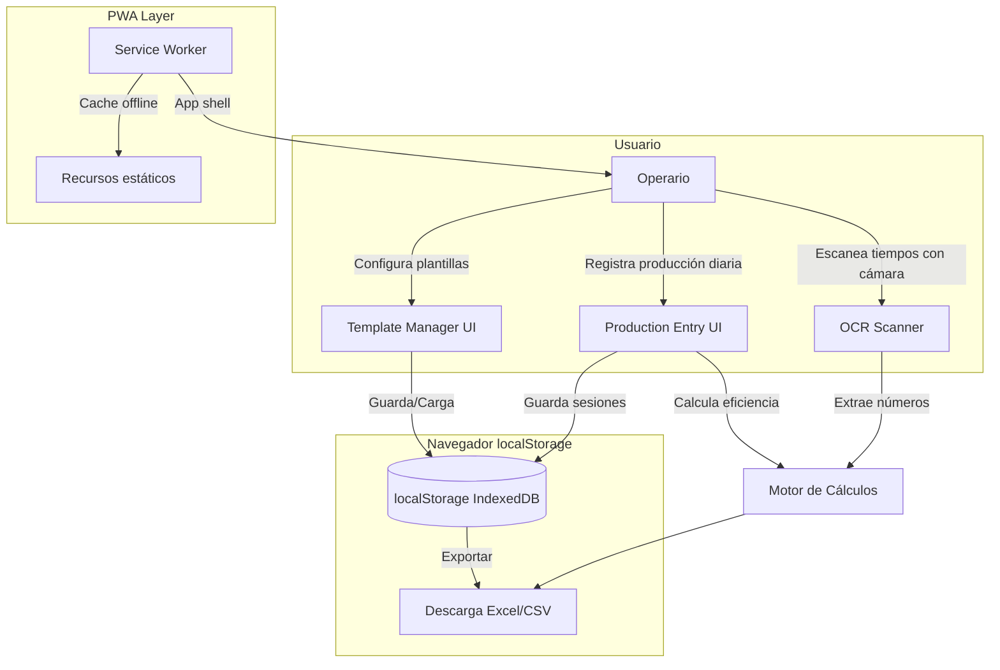

# Plan de Arquitectura: Calculadora de Producción Generalista

> Transformar la calculadora PYL23 específica en una calculadora de producción genérica y configurable, orientada a portafolio profesional.

---

## 1. Resumen Ejecutivo

### Objetivo
Convertir la calculadora actual (hardcodeada para línea PYL23) en una **calculadora universal de producción industrial** donde cualquier operario pueda:
- Crear sus propias plantillas de cálculo
- Configurar modelos, medidas y eficiencias esperadas
- Guardar todo en el navegador (sin backend)
- Exportar resultados a Excel

### Valor para portafolio
| Aspecto | Impacto en CV |
|---|---|
| **PWA moderna** | Service Worker, offline, instalable |
| **OCR (Tesseract.js)** | Visión por computadora desde el navegador |
| **Exportación Excel** | Integración con sistemas ofimáticos |
| **Template engine** | Arquitectura de datos configurable |
| **TDD + tests** | Madurez profesional de ingeniería |
| **UI/UX pulida** | Diseño dark mode responsive |

---

## 2. Arquitectura General

### Diagrama de flujo de datos



### Estructura de archivos (propuesta)

```
calculadora_pyl23-main/
├── index.html          # App principal (refactorizada)
├── manifest.json       # PWA manifest (actualizado)
├── sw.js               # Service Worker (limpiado)
├── ICON.png            # Icono
├── README.md           # Documentación actualizada
├── .clinerules         # Reglas TDD
├── docs/
│   ├── roadmap.md
│   └── ai/
│       └── ...
├── tools-ai/
│   └── notebooklm/
│       └── ...
└── plans/
    └── 001-calculadora-produccion-generalista.md
```

**Decisión:** Mantener todo en un solo `index.html` para simplicidad (portafolio, no hay bundler). Si el proyecto crece, se puede migrar a módulos JS.

---

## 3. Modelo de Datos

### Template (Plantilla de configuración)

```typescript
interface Template {
  id: string;                    // UUID generado
  name: string;                  // Nombre visible (ej: "Línea de ensamblaje A")
  description: string;           // Descripción opcional
  factoryName: string;           // Nombre de la fábrica/área
  efficiencyType: 'pieces_per_hour' | 'meters_per_hour';
  expectedEfficiency: number;    // Valor esperado (ej: 2500 piezas/h o 15000 m/h)
  models: Model[];               // Lista de modelos que fabrica
  createdAt: string;             // ISO date
  updatedAt: string;             // ISO date
}

interface Model {
  id: string;                    // UUID
  name: string;                  // Ej: "Modelo A", "Pieza X200"
  lengthMm: number;              // Longitud en milímetros
  piecesPerPallet: number;       // Piezas por palet (default: 480)
}
```

### ProductionSession (Sesión de producción diaria)

```typescript
interface ProductionSession {
  id: string;
  templateId: string;            // Referencia al template usado
  templateName: string;          // Snapshot del nombre (por si se borra el template)
  date: string;                  // Fecha ISO
  shiftHours: number;            // Horas del turno (ej: 7.75)
  entries: ProductionEntry[];    // Entradas por modelo
  coilChangeMinutes: number[];   // Minutos por cambio de bobina (opcional)
  totalMeters: number;           // Calculado
  totalPieces: number;           // Calculado
  theoreticalTime: number;       // Calculado (horas)
  efficiency: number;            // Calculado (%)
  createdAt: string;
}
```

### ProductionEntry (Entrada por modelo)

```typescript
interface ProductionEntry {
  modelId: string;
  modelName: string;
  lengthMm: number;
  pallets: number;
  pieces: number;    // = pallets * piecesPerPallet
  meters: number;    // = (lengthMm / 1000) * pieces
}
```

---

## 4. Almacenamiento: localStorage + IndexedDB

### Estrategia

| Dato | Almacenamiento | Clave |
|---|---|---|
| Plantillas | `localStorage.getItem('templates')` | JSON array serializado |
| Sesiones de producción | `localStorage.getItem('sessions')` | JSON array serializado |
| Backup/Export | Descarga manual como `.json` o `.xlsx` | Archivo |

### Por qué localStorage (y no base de datos externa)

1. **0 coste** — no necesita servidor, ni API keys, ni registro
2. **Offline nativo** — funciona sin internet (ideal para fábricas)
3. **Simple** — para portafolio, es más que suficiente
4. **Exportable** — el usuario puede descargar un backup JSON
5. **Límite** — ~5-10MB, más que suficiente para plantillas y sesiones

Si en el futuro se necesita multi-dispositivo, se migra a Supabase (gratis).

### Helper class (esbozo)

```javascript
class Storage {
  static getTemplates() { /* ... */ }
  static saveTemplate(t) { /* ... */ }
  static deleteTemplate(id) { /* ... */ }
  static getSessions() { /* ... */ }
  static saveSession(s) { /* ... */ }
  static exportToJson(data) { /* download as file */ }
  static importFromJson(file) { /* parse and save */ }
}
```

---

## 5. Módulos de la UI

### Estructura de pestañas (navegación principal)

1. **📋 Plantillas** — CRUD de plantillas
2. **📝 Producción** — Registrar producción diaria usando una plantilla
3. **📊 Historial** — Ver sesiones anteriores y exportar
4. **⚙️ OCR** — Escáner de tiempos (el existente)

### Tab 1: Plantillas (Template Manager)

```
┌─────────────────────────────────────┐
│  HERRAMIENTAS DE PRODUCCIÓN         │
│  CONTROL DE PLANTA                   │
├─────────────────────────────────────┤
│ [Plantillas] [Producción] [Historial]│
├─────────────────────────────────────┤
│  PLANTILLAS                           │
│  ┌───────────────────────────────┐   │
│  │ 📁 Línea Ensamblaje A        │   │
│  │   Fábrica Metalúrgica XYZ    │   │
│  │   📏 metros/hora · 15000 m/h │   │
│  │   🗑️ ✏️ 📋                  │   │
│  ├───────────────────────────────┤   │
│  │ 📁 Inyección Plásticos       │   │
│  │   Fábrica Polímeros SA       │   │
│  │   📦 piezas/hora · 2500 p/h  │   │
│  │   🗑️ ✏️ 📋                  │   │
│  └───────────────────────────────┘   │
│  [+ Crear Nueva Plantilla]           │
└─────────────────────────────────────┘
```

### Tab 2: Producción (al seleccionar una plantilla)

```
┌─────────────────────────────────────┐
│  PRODUCCIÓN: Línea Ensamblaje A     │
│  [Cambiar Plantilla ▼]              │
├─────────────────────────────────────┤
│  METROS FABRICADOS POR MODELO        │
│  ┌───────────────────────────────┐   │
│  │ Modelo A │ 2500mm │ 3 palets │ × │
│  │ Modelo B │ 3000mm │ 5 palets │ × │
│  │ Modelo C │ 3500mm │ 2 palets │ × │
│  └───────────────────────────────┘   │
│  [+ Añadir Modelo]                   │
│                                      │
│  HORAS TURNO: [7.75 ▼]              │
│                                      │
│  [CAMBIOS DE BOBINA]                 │
│  [📷 Escanear] [⌨️ Escribir]        │
│  ┌───────────────────────────────┐   │
│  │ 8 6 9 7 8                     │   │
│  └───────────────────────────────┘   │
│                                      │
│  [📐 CALCULAR EFICIENCIA]            │
│  [📥 Exportar a Excel]               │
├─────────────────────────────────────┤
│  RESULTADOS                          │
│  Total piezas:   14.400              │
│  Total metros:   38.400,00           │
│  Tiempo teórico: 2,56 h              │
│  ┌───────────────────────────────┐   │
│  │     EFICIENCIA FINAL          │   │
│  │          89%                  │   │
│  └───────────────────────────────┘   │
└─────────────────────────────────────┘
```

### Tab 3: Historial

```
┌─────────────────────────────────────┐
│  HISTORIAL DE PRODUCCIÓN             │
├─────────────────────────────────────┤
│  ┌───────────────────────────────┐   │
│  │ 25/06/2026 · Ensamblaje A    │   │
│  │ 7.75h · 89% · 📥 Excel · 🗑️  │   │
│  ├───────────────────────────────┤   │
│  │ 24/06/2026 · Ensamblaje A    │   │
│  │ 7.50h · 95% · 📥 Excel · 🗑️  │   │
│  ├───────────────────────────────┤   │
│  │ 23/06/2026 · Inyección       │   │
│  │ 7.75h · 72% · 📥 Excel · 🗑️  │   │
│  └───────────────────────────────┘   │
│  [📥 Exportar Todo a Excel]         │
└─────────────────────────────────────┘
```

---

## 6. Exportación a Excel

### Opciones técnicas evaluadas

| Opción | Coste | Facilidad | Portafolio |
|---|---|---|---|
| **CSV manual** | Gratis | Muy fácil | Bajo impacto |
| **SheetJS (xlsx)** | Gratis (MIT) | Fácil | ✅ Alto impacto |
| **Google Sheets API** | Gratis (límites) | Compleja | Medio |
| **Excel JavaScript API** | Requiere Office | Compleja | Bajo |

**Recomendación: SheetJS (CDN)** — genera archivos `.xlsx` reales desde el navegador sin backend.

```html
<script src="https://cdn.sheetjs.com/xlsx-0.20.2/package/dist/xlsx.full.min.js"></script>
```

### Formato del Excel exportado

| Fecha | Plantilla | Turno(h) | Modelo | Medida(mm) | Palets | Piezas | Metros | Cambio Bobina(min) | Eficiencia(%) |
|---|---|---|---|---|---|---|---|---|---|
| 25/06/2026 | Ensamblaje A | 7.75 | Modelo A | 2500 | 3 | 1440 | 3600 | 8 | 89% |
| 25/06/2026 | Ensamblaje A | 7.75 | Modelo B | 3000 | 5 | 2400 | 7200 | 6 | 89% |

**Adicional:** Exportación de respaldo en JSON para importar/exportar todas las plantillas.

---

## 7. Plan de Implementación por Fases

### Fase 1: Limpieza y Base (Día 1)
- [ ] Limpiar merge conflict en `sw.js`
- [ ] Actualizar `manifest.json` con branding genérico
- [ ] Refactorizar estructura HTML: separar CSS, HTML y JS en secciones claras
- [ ] Crear `Storage` helper class para localStorage

### Fase 2: Sistema de Plantillas (Día 2)
- [ ] UI de creación/edición de plantillas
- [ ] Configuración de modelos (nombre + medida)
- [ ] Selector de tipo de eficiencia (piezas/hora vs metros/hora)
- [ ] Guardado y carga desde localStorage

### Fase 3: Motor de Producción (Día 3)
- [ ] Cargar plantilla y mostrar modelos disponibles
- [ ] Input por modelo (cantidad de palets/unidades)
- [ ] Cálculo de eficiencia usando el valor esperado de la plantilla
- [ ] Sección de cambios de bobina (OCR existente adaptado)

### Fase 4: Historial y Excel (Día 4)
- [ ] Guardar sesiones de producción en localStorage
- [ ] Tabla de historial con opciones de borrado
- [ ] Exportación a Excel con SheetJS
- [ ] Exportación/Importación de plantillas como JSON (backup)

### Fase 5: Pulido y Portafolio (Día 5)
- [ ] Tests unitarios (TDD: calcular eficiencia, validar datos)
- [ ] Actualizar README con documentación profesional
- [ ] Capturas de pantalla para LinkedIn
- [ ] Despliegue (GitHub Pages)

---

## 8. Decisiones Técnicas

| Decisión | Opción elegida | Alternativa descartada | Motivo |
|---|---|---|---|
| **Framework** | Vanilla JS | React/Vue/Svelte | Sin bundler, deploy inmediato, portafolio muestra vanilla |
| **Almacenamiento** | localStorage | IndexedDB puro | Simplicidad; si hay >10k registros, migrar a IndexedDB |
| **Excel** | SheetJS CDN | CSV puro | .xlsx real impresiona más en portafolio |
| **OCR** | Tesseract.js (existente) | Google Cloud Vision | Gratuito, offline, ya implementado |
| **CSS** | CSS Variables (existente) | Tailwind/Bootstrap | Ya funciona, sin build step |
| **Routing** | Tabs con JS vanilla | React Router | No hay URLs, es SPA simple |

---

## 9. Riesgos y Mitigaciones

| Riesgo | Impacto | Mitigación |
|---|---|---|
| localStorage se borra | Alto | Exportación periódica a JSON + backup manual |
| SheetJS cambia su CDN | Medio | Incluir fallback a CSV |
| Tesseract.js lento offline | Medio | Mantener OCR como opcional, permitir entrada manual |
| Código demasiado largo en 1 archivo | Bajo | Si supera 1500 líneas, dividir en módulos |

---

## 10. Criterios de Aceptación

- [ ] Usuario puede crear/modificar/eliminar plantillas
- [ ] Cada plantilla tiene: nombre, modelos, tipo de eficiencia, valor esperado
- [ ] Al seleccionar una plantilla, se cargan sus modelos predefinidos
- [ ] El cálculo usa el valor de eficiencia esperado de la plantilla
- [ ] Los resultados se guardan en localStorage
- [ ] Se puede exportar a Excel (.xlsx) cualquier sesión
- [ ] Se puede exportar/importar plantillas como JSON
- [ ] El OCR sigue funcionando (adaptado)
- [ ] PWA funciona offline
- [ ] El merge conflict de sw.js está resuelto
- [ ] README documenta cómo usar y desplegar

---

## 11. Validación (TDD)

### Tests a escribir

| Test | Tipo | Prioridad |
|---|---|---|
| `calcularEficiencia(producido, esperado, horas)` devuelve % correcto | Unit | Alta |
| `calcularMetros(medidaMm, piezas)` devuelve metros lineales | Unit | Alta |
| `validarTemplate(t)` rechaza templates sin nombre o sin modelos | Unit | Alta |
| `storage.guardarTemplate(t)` lo recupera correctamente | Unit | Media |
| `exportarExcel(session)` genera archivo válido | Integration | Media |

### Comandos de validación

```bash
# Los tests se ejecutarán con node (sin DOM)
node --test tests/
```

---

## 12. Estado Actual del Código

### Problemas detectados en el código actual

1. **Merge conflict en `sw.js`** (líneas 1-56) — HEAD vs 7dbc709. Necesita resolución.
2. **Constantes hardcodeadas**: `THEORETICAL_VELOCITY = 2348`, `PIEZAS_POR_PALET = 480`
3. **Sin separación de responsabilidades**: Todo en un solo `<script>` inline
4. **Sin manejo de errores** en cálculos (asume inputs válidos)
5. **Título/header fijo**: "PYL 23 | Eficiencia" y "HERRAMIENTAS PYL 23"

### Lo que se conserva

- ✅ Diseño visual (dark theme, colores, tipografía)
- ✅ PWA manifest y service worker
- ✅ OCR con Tesseract.js (se adapta a la sección de cambios)
- ✅ Cálculo de eficiencia base (se refactoriza para usar valores dinámicos)
- ✅ Estructura de tabs

---

## Siguiente paso

Revisar este plan y aprobarlo para pasar a la fase de implementación en modo `💻 Code`.
